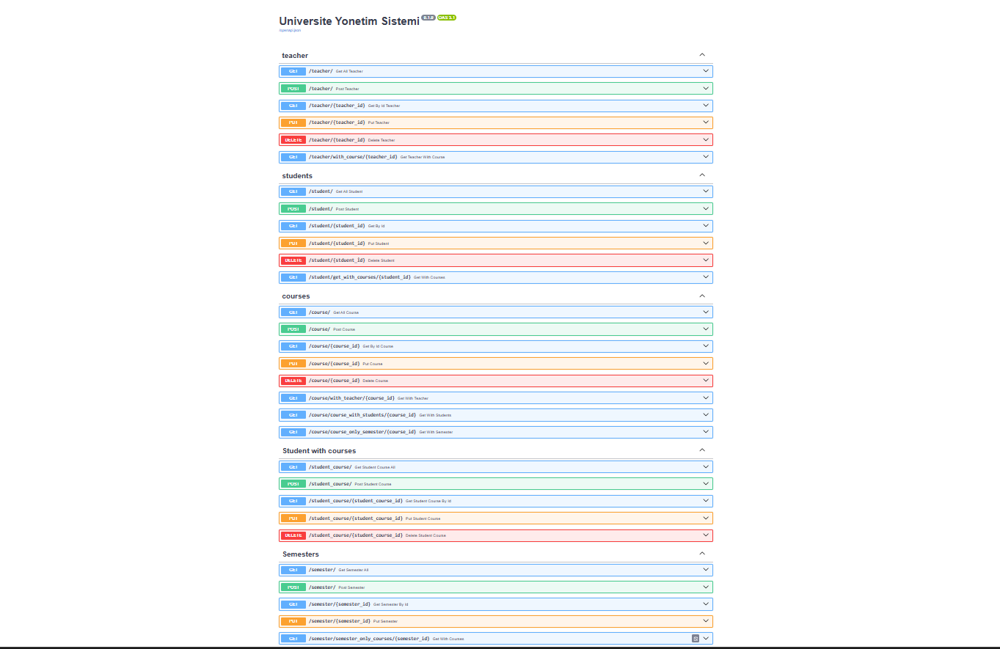

# Üniversite Yönetim Sistemi

FastAPI, SQLAlchemy ve Alembic ile geliştirilmiş, hoca-öğrenci-ders yönetimini sağlayan bir backend API'si. PostgreSQL veritabanı ile Docker üzerinde çalışacak şekilde yapılandırılmıştır.

## Özellikler

- **Hoca (Teacher)** yönetimi — isim, unvan, bölüm bilgileriyle
- **Öğrenci (Student)** yönetimi — öğrenci numarası dahil
- **Ders (Course)** yönetimi — her ders bir hocaya bağlı
- **Ders Kayıt (StudentCourse)** sistemi — öğrencilerin derslere kaydını yöneten many-to-many ilişki
- Veritabanı şeması, Alembic migration'ları ile versiyonlanarak yönetiliyor
- Docker ile PostgreSQL üzerinde tam entegre çalışma

## Kullanılan Teknolojiler

- **FastAPI** — REST API framework
- **SQLAlchemy** — ORM
- **Alembic** — veritabanı migration yönetimi
- **PostgreSQL** — veritabanı (Docker üzerinde)
- **Pydantic** — veri doğrulama
- **Docker & Docker Compose** — konteynerleştirme

## Proje Yapısı

```
├── main.py              # FastAPI endpoint'leri
├── models.py             # SQLAlchemy ORM modelleri
├── schemas.py             # Pydantic şemaları
├── database.py             # Veritabanı bağlantı ayarları
├── alembic/                 # Migration dosyaları
├── requirements.txt          # Python bağımlılıkları
├── Dockerfile                  # API imajı tarifi
└── docker-compose.yml           # api + postgres servisleri
```

## Kurulum ve Çalıştırma

### Docker ile (önerilen)

```bash
docker compose up --build
```

Ayrı bir terminalde, veritabanı migration'larını uygula:

```bash
docker compose exec api alembic upgrade head
```

API artık şu adreste çalışıyor: `http://localhost:8000`

### Lokal (Docker'sız, SQLite ile)

```bash
python -m venv venv
venv\Scripts\activate
pip install -r requirements.txt
alembic upgrade head
uvicorn main:app --reload
```
## API Dokümantasyonu

Uygulama çalışırken, interaktif Swagger arayüzüne şu adresten ulaşılabilir:

```
http://localhost:8000/docs
```



## Veri Modeli

```
Teacher (1) ----< Course (N)
Student (N) ----< StudentCourse >---- (N) Course
```

Bir hocanın birden fazla dersi olabilir. Bir öğrenci, `StudentCourse` ara tablosu üzerinden birden fazla derse kayıtlı olabilir.

## Endpoint Özeti

| Kaynak | Endpoint'ler |
|---|---|
| Teacher | `GET /teacher`, `GET /teacher_by_id/{id}`, `POST /teacher`, `PUT /teacher/{id}`, `DELETE /teacher/{id}` |
| Student | `GET /student`, `GET /student_by_id/{id}`, `POST /student`, `PUT /student/{id}`, `DELETE /student/{id}` |
| Course | `GET /course`, `GET /course_by_id/{id}`, `POST /course`, `PUT /course/{id}`, `DELETE /course/{id}` |
| StudentCourse | `GET /studentCourse`, `GET /studentCourse_by_id/{id}`, `POST /studentCourse`, `DELETE /studentCourse/{id}` |