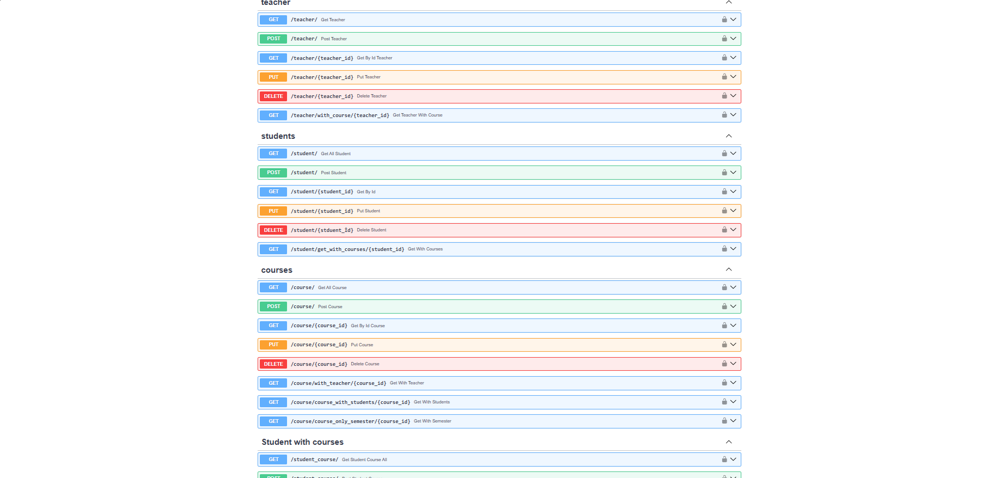
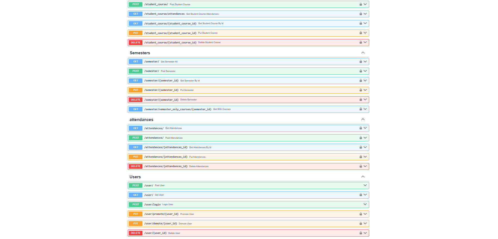

# Üniversite Yönetim Sistemi

FastAPI, SQLAlchemy ve Alembic ile geliştirilmiş, hoca-öğrenci-ders yönetimini sağlayan, JWT tabanlı güvenlik katmanına sahip bir backend API'si. PostgreSQL veritabanı ile Docker üzerinde, katmanlı (layered) bir mimariyle çalışacak şekilde yapılandırılmıştır.
## Mimari


İstemci (web/mobil), JWT token ile FastAPI uygulamasına bağlanır. FastAPI, router → service → model katmanlarından oluşur ve SQLAlchemy üzerinden PostgreSQL'e erişir. Her iki servis de (api + postgres), Docker Compose ile, healthcheck destekli olarak birlikte çalışır.
## Özellikler

- **Hoca (Teacher)** yönetimi — isim, unvan, bölüm bilgileriyle
- **Öğrenci (Student)** yönetimi — benzersiz öğrenci numarasıyla
- **Ders (Course)** yönetimi — her ders bir hocaya ve bir döneme bağlı
- **Dönem (Semester)** yönetimi — aynı dönemde aynı isimde ders açılması engellenir
- **Ders Kayıt (StudentCourse)** sistemi — öğrenci-ders ilişkisini yöneten many-to-many yapı, vize/final notu ile birlikte
- **Devamsızlık (Attendance)** takibi — her ders günü için ayrı yoklama kaydı
- **Kullanıcı Yönetimi ve Güvenlik** — JWT tabanlı kimlik doğrulama, şifreler bcrypt ile hash'lenir
- **Rol Bazlı Yetkilendirme** — `user` / `admin` rolleri, hassas işlemler (silme) sadece admin'e açık
- **Filtre/Arama** — Teacher, Student, Course gibi kaynaklarda isim bazlı arama desteği
- **İş Kuralları (Business Logic)** — benzersizlik kontrolleri, çifte kayıt engelleme, referans bütünlüğü korumaları
- Veritabanı şeması, Alembic migration'ları ile versiyonlanarak yönetilir; konteyner başlangıcında migration'lar otomatik uygulanır
- Docker ile PostgreSQL üzerinde, healthcheck destekli tam entegre çalışma

## Kullanılan Teknolojiler

- **FastAPI** — REST API framework
- **SQLAlchemy** — ORM
- **Alembic** — veritabanı migration yönetimi
- **PostgreSQL** — veritabanı (Docker üzerinde)
- **Pydantic** — veri doğrulama
- **Passlib (bcrypt)** — şifre hash'leme
- **python-jose** — JWT üretimi ve doğrulaması
- **Docker & Docker Compose** — konteynerleştirme, healthcheck ile otomatik migration

## Proje Yapısı

Proje, model / şema / servis / router olmak üzere katmanlı bir mimariyle organize edilmiştir:

```
app/
├── main.py                    # Uygulama girişi, router'ların bağlandığı yer
├── dependencies.py             # get_db, get_current_user, get_current_admin_user
├── security.py                  # Şifre hash'leme, JWT üretme/doğrulama
├── db/
│   └── database.py                # Veritabanı bağlantısı (engine, SessionLocal, Base)
├── models/                          # SQLAlchemy ORM modelleri
│   ├── teacher.py, student.py, course.py, semester.py
│   ├── student_course.py, attendances.py, user.py
├── schemas/                          # Pydantic şemaları (Create/Response çiftleri)
├── services/                          # İş mantığı (veritabanı işlemleri, iş kuralları)
└── routers/                           # Endpoint tanımları
alembic/                                # Migration dosyaları
requirements.txt                         # Python bağımlılıkları
Dockerfile                                # API imajı tarifi, başlangıçta otomatik migration
docker-compose.yml                         # api + postgres servisleri (healthcheck ile)
```

## Kurulum ve Çalıştırma

### Docker ile (önerilen)

```bash
docker compose up --build
```

Bu komut, PostgreSQL'in hazır olmasını bekler, ardından veritabanı migration'larını **otomatik olarak** uygulayıp API'yi başlatır — ayrıca bir komut çalıştırmanıza gerek yoktur.

API artık şu adreste çalışıyor: `http://localhost:8000`

### Lokal (Docker'sız, SQLite ile)

```bash
python -m venv venv
venv\Scripts\activate
pip install -r requirements.txt
alembic upgrade head
uvicorn app.main:app --reload
```

## API Dokümantasyonu

Uygulama çalışırken, interaktif Swagger arayüzüne şu adresten ulaşılabilir:

```
http://localhost:8000/docs
```




## Kimlik Doğrulama (Authentication)

API, JWT (JSON Web Token) tabanlı kimlik doğrulama kullanır.

1. **Kayıt ol:** `POST /user/` — kullanıcı adı ve şifre (min. 6 karakter) ile hesap oluşturulur, şifre bcrypt ile hash'lenerek saklanır.
2. **Giriş yap:** `POST /user/login` — doğru kimlik bilgileriyle, 30 dakika geçerli bir JWT `access_token` döner.
3. **Korumalı istekler:** Alınan token, `Authorization: Bearer <token>` başlığıyla gönderilir. `/docs` üzerinden test ederken sağ üstteki **Authorize** butonu kullanılabilir.
4. **Roller:** Yeni kullanıcılar varsayılan olarak `user` rolüyle oluşturulur. Bir admin, `PUT /user/{id}/promote` ile başka bir kullanıcıyı admin yapabilir; `DELETE` gibi hassas işlemler sadece admin rolüne açıktır.

**Register ve login hariç, projedeki tüm endpoint'ler giriş yapılmasını gerektirir.**

## Veri Modeli

```
Teacher (1) ----< Course (N) >---- (1) Semester
Student (N) ----< StudentCourse >---- (N) Course
StudentCourse (1) ----< Attendance (N)
```

- Bir hocanın birden fazla dersi olabilir; bir ders tek bir hocaya ve tek bir döneme bağlıdır.
- Bir öğrenci, `StudentCourse` ara tablosu üzerinden birden fazla derse kayıtlı olabilir; her kayıt vize/final notu taşıyabilir.
- Her `StudentCourse` kaydı, tarihe bağlı birden fazla `Attendance` (yoklama) kaydına sahip olabilir.

## Endpoint Özeti

| Kaynak | Endpoint'ler |
|---|---|
| Auth | `POST /user/` (kayıt), `POST /user/login` (giriş) |
| Admin | `PUT /user/{id}/promote`, `PUT /user/{id}/demote`, `DELETE /user/{id}` |
| Teacher | `GET /teacher/`, `GET /teacher/{id}`, `POST /teacher/`, `PUT /teacher/{id}`, `DELETE /teacher/{id}`, `GET /teacher/with_course/{id}` |
| Student | `GET /student/`, `GET /student/{id}`, `POST /student/`, `PUT /student/{id}`, `DELETE /student/{id}` |
| Course | `GET /course/`, `GET /course/{id}`, `POST /course/`, `PUT /course/{id}`, `DELETE /course/{id}` |
| Semester | `GET /semester/`, `GET /semester/{id}`, `POST /semester/`, `PUT /semester/{id}`, `DELETE /semester/{id}` |
| StudentCourse | `GET /student_course/`, `GET /student_course/{id}`, `POST /student_course/`, `PUT /student_course/grade`, `DELETE /student_course/{id}` |
| Attendance | `GET /attendances/`, `GET /attendances/{id}`, `POST /attendances/`, `PUT /attendances/{id}`, `DELETE /attendances/{id}` |

*(Register ve login hariç tüm endpoint'ler için geçerli bir JWT token gereklidir.)*
